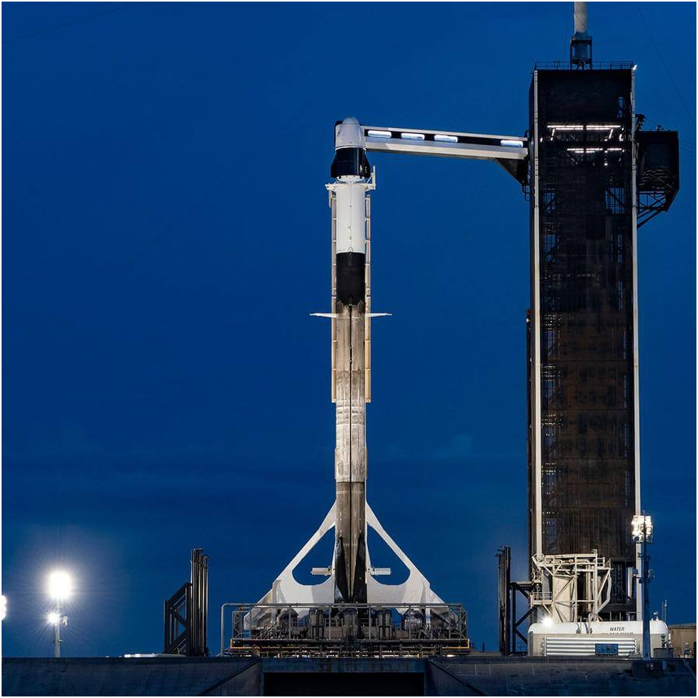
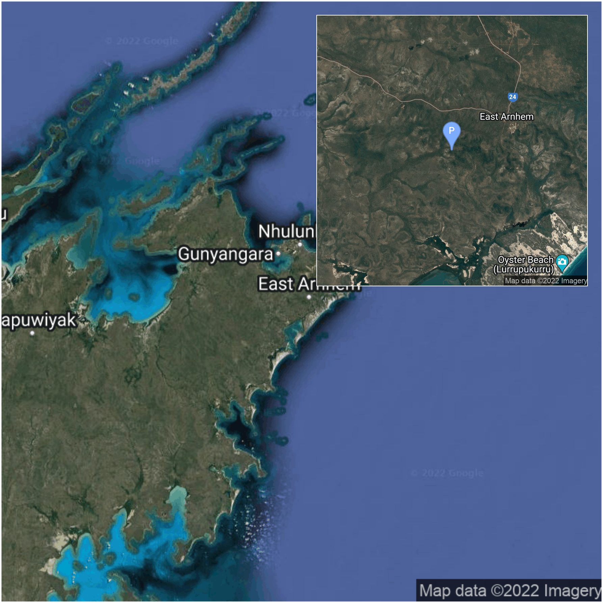

M.Sc. Aerospace Engineering at [Delft University of Technology](https://www.tudelft.nl/en/) 🎓

- 🔭 I’m currently working on my M.Sc. thesis on autonomous exploration of small celestial bodies using ML.
- 🌱 I’m currently learning about the promising subfield of self-supervised learning.
- 👯 I’m looking to collaborate on a rust library for numerical mathematics/numerical astrodynamics
- 💬 Ask me about Netflix series, ocean diving, golf, Mauritius, TU Delft or my doggo.
- 📫 How to reach me: `geoffreygarrett99 at gmail dot com`
- 😄 Pronouns: he/him
- ⚡ Fun fact: I'm an amateur dog trainer.
<!-- - 🤔 I’m looking for help with ... -->

## My GitHub state 📊

<table>
<tr>
<td width="50%" valign="top">

<h3 align="center"> Open issues 🆘 </h3>

<!-- github issues starts -->
* [KaTeX rendering after markdown parser.](https://github.com/geoffreygarrett/notes.geoffreygarrett.com/issues/4)   <a href="https://www.timeanddate.com/worldclock/fixedtime.html?iso=20220601T130043">2022-06-01 13:00:43 UTC</a> - <a href="https://github.com/geoffreygarrett">geoffreygarrett</a> 
* [Implement `conda` package of `multidoc` into workflow](https://github.com/tudat-team/tudat-multidoc/issues/43)   <a href="https://www.timeanddate.com/worldclock/fixedtime.html?iso=20220307T122202">2022-03-07 12:22:02 UTC</a> - <a href="https://github.com/geoffreygarrett">geoffreygarrett</a> 
* [Request: change of style for enumeration](https://github.com/tudat-team/tudat-multidoc/issues/35)   <a href="https://www.timeanddate.com/worldclock/fixedtime.html?iso=20220222T231953">2022-02-22 23:19:53 UTC</a> - <a href="https://github.com/gaffarelj">gaffarelj</a> 
* [Revise "about" page](https://github.com/tudat-team/tudat-space/issues/62)   <a href="https://www.timeanddate.com/worldclock/fixedtime.html?iso=20220218T130818">2022-02-18 13:08:18 UTC</a> - <a href="https://github.com/FilippoOggionni">FilippoOggionni</a> 
* [Very large `.git` history due to old resources from legacy](https://github.com/tudat-team/tudat/issues/66)   <a href="https://www.timeanddate.com/worldclock/fixedtime.html?iso=20220217T112803">2022-02-17 11:28:03 UTC</a> - <a href="https://github.com/geoffreygarrett">geoffreygarrett</a> 
* [Understand and fix rever ("news" workflow)](https://github.com/tudat-team/tudatpy/issues/46)   <a href="https://www.timeanddate.com/worldclock/fixedtime.html?iso=20220122T210640">2022-01-22 21:06:40 UTC</a> - <a href="https://github.com/FilippoOggionni">FilippoOggionni</a> 
* [Multiline tagging for parser](https://github.com/tudat-team/tudat-multidoc/issues/19)   <a href="https://www.timeanddate.com/worldclock/fixedtime.html?iso=20211230T215945">2021-12-30 21:59:45 UTC</a> - <a href="https://github.com/gaffarelj">gaffarelj</a> 
* [Intersphinx linking to properties not working](https://github.com/tudat-team/tudat-space/issues/27)   <a href="https://www.timeanddate.com/worldclock/fixedtime.html?iso=20211105T141639">2021-11-05 14:16:39 UTC</a> - <a href="https://github.com/DominicDirkx">DominicDirkx</a> 
* [Move content from tudat-space to tudat-developer-docs](https://github.com/tudat-team/tudat-developer-docs/issues/11)   <a href="https://www.timeanddate.com/worldclock/fixedtime.html?iso=20211014T120651">2021-10-14 12:06:51 UTC</a> - <a href="https://github.com/FilippoOggionni">FilippoOggionni</a> 

<!-- github issues ends -->

</td>
<td width="50%" valign="top">

<h3 align="center"> Closed issues ✅ </h3>

<!-- github issues starts -->
* [Start using proper versioning for the conda package](https://github.com/tudat-team/tudat-bundle/issues/5)   <a href="https://www.timeanddate.com/worldclock/fixedtime.html?iso=20211230T214648">2021-12-30 21:46:48 UTC</a> - <a href="https://github.com/gaffarelj">gaffarelj</a> 
* [Ensure readthedocs build fails if build.sh fails](https://github.com/tudat-team/tudat-multidoc/issues/1)   <a href="https://www.timeanddate.com/worldclock/fixedtime.html?iso=20211024T172410">2021-10-24 17:24:10 UTC</a> - <a href="https://github.com/FilippoOggionni">FilippoOggionni</a> 
* [Investigate autocomplete on PyCharm and stubs files ](https://github.com/tudat-team/tudatpy/issues/22)   <a href="https://www.timeanddate.com/worldclock/fixedtime.html?iso=20211020T151214">2021-10-20 15:12:14 UTC</a> - <a href="https://github.com/FilippoOggionni">FilippoOggionni</a> 
* [Adding webpages to tudat-space (from legacy content)](https://github.com/tudat-team/tudat-space/issues/17)   <a href="https://www.timeanddate.com/worldclock/fixedtime.html?iso=20211014T121245">2021-10-14 12:12:45 UTC</a> - <a href="https://github.com/FilippoOggionni">FilippoOggionni</a> 
* [Developer documentation](https://github.com/tudat-team/tudat-space/issues/13)   <a href="https://www.timeanddate.com/worldclock/fixedtime.html?iso=20210416T083647">2021-04-16 08:36:47 UTC</a> - <a href="https://github.com/geoffreygarrett">geoffreygarrett</a> 
* [Linux build failing with boost 1.70+](https://github.com/tudat-team/tudat/issues/9)   <a href="https://www.timeanddate.com/worldclock/fixedtime.html?iso=20200926T162518">2020-09-26 16:25:18 UTC</a> - <a href="https://github.com/geoffreygarrett">geoffreygarrett</a> 
* [Failing tests for Clang build on Windows using MSVC libraries](https://github.com/tudat-team/tudat/issues/7)   <a href="https://www.timeanddate.com/worldclock/fixedtime.html?iso=20200926T152756">2020-09-26 15:27:56 UTC</a> - <a href="https://github.com/geoffreygarrett">geoffreygarrett</a> 

<!-- github issues ends -->

</td>

</tr>

</table>

    
    
    
    

## Languages I code in 👨‍💻️

## Realtime Space Launches 🚀

### Spotlight 💡
The next launch, retrieved from the
<a href="https://thespacedevs.com/">The Space Devs</a>' public API, is the
Falcon 9 Block 5 | OneWeb 15 at the
<a href="https://en.wikipedia.org/wiki/Kennedy_Space_Center_Launch_Complex_39#Launch_Pad_39A">Launch Complex 39A</a> in
Kennedy Space Center, FL, USA

at <a href="https://www.timeanddate.com/worldclock/fixedtime.html?iso=20221206T223700">2022-12-06 22:37:00 UTC</a>. Until
then, this launch pad will have seen 153
out of 211 launches in this
region. The mission's status is currently To Be Confirmed
(TBC) 🟨  which means:
*awaiting official confirmation - current date is known with some certainty.* 
 
<blockquote>
  A batch of 40 satellites for the OneWeb satellite constellation, which is intended to provide global Internet broadband service for individual consumers. The constellation is planned to have around 648 microsatellites (of which 60 are spares), around 150 kg each, operating in Ku-band from low Earth orbit.
</blockquote>

  
  

### Within a month's time 📅

<table>
<tr>
<td width="50%" valign="top" align="left">

<!-- rocket launches starts -->
* 🟨    <b>OneWeb 15</b> from Kennedy Space Center, FL, USA.   <a href="https://www.timeanddate.com/worldclock/fixedtime.html?iso=20221206T223700">2022-12-06 22:37:00 UTC</a> -  
* 🟨    <b>Hakuto-R M1 & Lunar Flashlight</b> from Cape Canaveral, FL, USA.   <a href="https://www.timeanddate.com/worldclock/fixedtime.html?iso=20221207T080400">2022-12-07 08:04:00 UTC</a> -  
* 🟩    <b>Maiden Flight</b> from Pacific Spaceport Complex, Alaska, USA.   <a href="https://www.timeanddate.com/worldclock/fixedtime.html?iso=20221207T220000">2022-12-07 22:00:00 UTC</a> -  
* 🟩    <b>Virginia is for Launch Lovers</b> from Wallops Island, Virginia, USA.   <a href="https://www.timeanddate.com/worldclock/fixedtime.html?iso=20221209T230000">2022-12-09 23:00:00 UTC</a> -  
* 🟧    <b>O3b mPower 1 & 2</b> from Cape Canaveral, FL, USA.   <a href="https://www.timeanddate.com/worldclock/fixedtime.html?iso=20221213T200000">2022-12-13 20:00:00 UTC</a> -  
* 🟨    <b>Galaxy 35 & 36, MTG-I1</b> from Kourou, French Guiana.   <a href="https://www.timeanddate.com/worldclock/fixedtime.html?iso=20221213T203000">2022-12-13 20:30:00 UTC</a> -  
* 🟩    <b>SWOT - Surface Water and Ocean Topography</b> from Vandenberg SFB, CA, USA.   <a href="https://www.timeanddate.com/worldclock/fixedtime.html?iso=20221215T114640">2022-12-15 11:46:40 UTC</a> -  
* 🟩    <b>Pléiades Neo 5 & 6</b> from Kourou, French Guiana.   <a href="https://www.timeanddate.com/worldclock/fixedtime.html?iso=20221221T014700">2022-12-21 01:47:00 UTC</a> -  
* 🟧    <b>EROS-C3</b> from Vandenberg SFB, CA, USA.   <a href="https://www.timeanddate.com/worldclock/fixedtime.html?iso=20221229T065800">2022-12-29 06:58:00 UTC</a> -  
* 🟧    <b>Starlink Group 2-4</b> from Vandenberg SFB, CA, USA.   <a href="https://www.timeanddate.com/worldclock/fixedtime.html?iso=20221231T000000">2022-12-31 00:00:00 UTC</a> -  

<!-- rocket launches ends -->

    <table class="tg">
    <thead>
      <tr>
        <th class="tg-0pky">Symbol</th>
        <th class="tg-0pky">Status</th>
      </tr>
    </thead>
    <tbody>
      <tr>
        <td class="tg-0pky">🟩</td>
        <td class="tg-0pky">Go For Launch (Go)</td>
      </tr>
      <tr>
        <td class="tg-0pky">🟨</td>
        <td class="tg-0pky">To Be Confirmed (TBC)</td>
      </tr>
      <tr>
        <td class="tg-0pky">🟧</td>
        <td class="tg-0pky">To Be Determined (TBD)</td>
      </tr>
    </tbody>
    </table>

</td>

</tr>

</table>

## Space feed 🍽️
<table>
<tr>
<td width="50%" valign="top">

<h3 align="center"> Spaceflight news 📅 </h3>

<!-- spaceflight news starts -->
* [Astronauts install new solar array outside International Space Station](https://spaceflightnow.com/2022/12/03/iss-eva-82/)   <a href="https://www.timeanddate.com/worldclock/fixedtime.html?iso=20221203T220438">2022-12-03 22:04:38 UTC</a>
* [Power upgrade: Station crew install new iROSA, work power channel issue on ISS](https://www.nasaspaceflight.com/2022/12/irosa-eva-dec-3/)   <a href="https://www.timeanddate.com/worldclock/fixedtime.html?iso=20221203T201055">2022-12-03 20:10:55 UTC</a>
* [SpaceX rolls out new business line focused on military satellite services](https://spacenews.com/spacex-rolls-out-new-business-line-focused-on-military-satellite-services/)   <a href="https://www.timeanddate.com/worldclock/fixedtime.html?iso=20221203T153443">2022-12-03 15:34:43 UTC</a>
* [Space Force establishes component at U.S. Central Command](https://spacenews.com/space-force-establishes-component-at-u-s-central-command/)   <a href="https://www.timeanddate.com/worldclock/fixedtime.html?iso=20221202T221443">2022-12-02 22:14:43 UTC</a>
* [NASA Sets Coverage of Orion’s Historic Moon Mission Return, Splashdown](http://www.nasa.gov/press-release/nasa-sets-coverage-of-orion-s-historic-moon-mission-return-splashdown)   <a href="https://www.timeanddate.com/worldclock/fixedtime.html?iso=20221202T212400">2022-12-02 21:24:00 UTC</a>
* [RS-25 engine performance “perfect” on Artemis I debut launch](https://www.nasaspaceflight.com/2022/12/artemis-i-rs25-review/)   <a href="https://www.timeanddate.com/worldclock/fixedtime.html?iso=20221202T193217">2022-12-02 19:32:17 UTC</a>
* [After bankruptcy and war, OneWeb turns to a competitor for help](https://arstechnica.com/science/2022/12/oneweb-sets-a-launch-date-for-next-week-on-a-falcon-9-rocket/)   <a href="https://www.timeanddate.com/worldclock/fixedtime.html?iso=20221202T150605">2022-12-02 15:06:05 UTC</a>
* [OneWeb aims to deploy a record 40 satellites in SpaceX mission](https://spacenews.com/oneweb-aims-to-deploy-a-record-40-satellites-in-spacex-mission/)   <a href="https://www.timeanddate.com/worldclock/fixedtime.html?iso=20221202T141444">2022-12-02 14:14:44 UTC</a>
* [Astra chief engineer resigns, CEO shakes up management ‘to execute faster’](https://www.cnbc.com/2022/12/02/astra-chief-engineer-benjamin-lyon-resigns-from-rocket-builder.html)   <a href="https://www.timeanddate.com/worldclock/fixedtime.html?iso=20221202T140944">2022-12-02 14:09:44 UTC</a>
* [Rocket Report: SpaceX launch delayed indefinitely; Virgin Orbit cancels funding round](https://arstechnica.com/science/2022/12/rocket-report-sls-gets-an-excellent-report-card-canadian-companys-sexbomb/)   <a href="https://www.timeanddate.com/worldclock/fixedtime.html?iso=20221202T130022">2022-12-02 13:00:22 UTC</a>

<!-- spaceflight news ends -->

</td>

<td width="50%" valign="top">

<h3 align="center"> Spaceflight blogs ✍️ </h3>

<!-- spaceflight blogs starts -->
* [Much has passed in decades past](https://www.planetary.org/the-downlink/much-has-passed-in-decades-past)   <a href="https://www.timeanddate.com/worldclock/fixedtime.html?iso=20221202T153501">2022-12-02 15:35:01 UTC</a>
* [NASA’s economic impact? Hundreds of thousands of jobs.](https://www.planetary.org/articles/nasas-economic-impact-fy2021)   <a href="https://www.timeanddate.com/worldclock/fixedtime.html?iso=20221202T140500">2022-12-02 14:05:00 UTC</a>
* [Best space pictures of the month: November 2022](https://www.planetary.org/articles/best-space-pictures-november-2022)   <a href="https://www.timeanddate.com/worldclock/fixedtime.html?iso=20221130T150503">2022-11-30 15:05:03 UTC</a>
* [What the 2022 midterm elections mean for NASA](https://www.planetary.org/articles/2022-midterm-elections)   <a href="https://www.timeanddate.com/worldclock/fixedtime.html?iso=20221129T140504">2022-11-29 14:05:04 UTC</a>
* [2022 impact report](https://www.planetary.org/articles/2022-impact-report)   <a href="https://www.timeanddate.com/worldclock/fixedtime.html?iso=20221124T150712">2022-11-24 15:07:12 UTC</a>
* [The best gift ideas for space fans in 2022](https://www.planetary.org/articles/best-gifts-space-fans-2022)   <a href="https://www.timeanddate.com/worldclock/fixedtime.html?iso=20221122T150830">2022-11-22 15:08:30 UTC</a>
* [Europe in Space - A European astronaut story](https://www.getrevue.co/profile/andrewparsonson/issues/a-european-astronaut-story-1459429)   <a href="https://www.timeanddate.com/worldclock/fixedtime.html?iso=20221121T143857">2022-11-21 14:38:57 UTC</a>
* [On the Issues](https://www.planetary.org/issues)   <a href="https://www.timeanddate.com/worldclock/fixedtime.html?iso=20221121T140811">2022-11-21 14:08:11 UTC</a>
* [Gifts from above](https://www.planetary.org/the-downlink/gifts-from-above)   <a href="https://www.timeanddate.com/worldclock/fixedtime.html?iso=20221118T202715">2022-11-18 20:27:15 UTC</a>
* [Launching and descending](https://www.planetary.org/the-downlink/launching-and-descending)   <a href="https://www.timeanddate.com/worldclock/fixedtime.html?iso=20221118T153802">2022-11-18 15:38:02 UTC</a>

<!-- spaceflight blogs ends -->

</td>

</tr>

</table>

  

  This <code>README.md</code> was last auto generated at <a href="https://www.timeanddate.com/worldclock/fixedtime.html?iso=20221204T024253">2022-12-04 02:42:53 UTC</a>
   
  <!-- <a href="https://medium.com/@g.h.garrett" target="_blank">Learn to add space launches to your profile here!</a> -->

