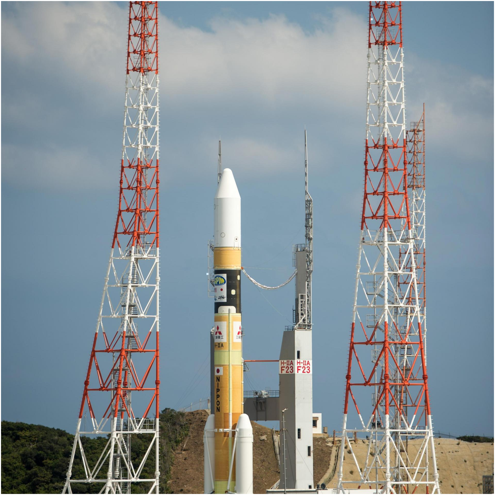

M.Sc. Aerospace Engineering at [Delft University of Technology](https://www.tudelft.nl/en/) 🎓

- 🔭 I’m currently working on my M.Sc. thesis on autonomous exploration of small celestial bodies using ML.
- 🌱 I’m currently learning about the promising subfield of self-supervised learning.
- 👯 I’m looking to collaborate on a rust library for numerical mathematics/numerical astrodynamics
- 💬 Ask me about Netflix series, ocean diving, golf, Mauritius, TU Delft or my doggo.
- 📫 How to reach me: `geoffreygarrett99 at gmail dot com`
- 😄 Pronouns: he/him
- ⚡ Fun fact: I'm an amateur dog trainer.
<!-- - 🤔 I’m looking for help with ... -->

## My GitHub state 📊

<table>
<tr>
<td width="50%" valign="top">

<h3 align="center"> Open issues 🆘 </h3>

<!-- github issues starts -->
* [Implement `conda` package of `multidoc` into workflow](https://github.com/tudat-team/tudat-multidoc/issues/43)   <a href="https://www.timeanddate.com/worldclock/fixedtime.html?iso=20220307T122202">2022-03-07 12:22:02 UTC</a> - <a href="https://github.com/geoffreygarrett">geoffreygarrett</a> 
* [Request: change of style for enumeration](https://github.com/tudat-team/tudat-multidoc/issues/35)   <a href="https://www.timeanddate.com/worldclock/fixedtime.html?iso=20220222T231953">2022-02-22 23:19:53 UTC</a> - <a href="https://github.com/gaffarelj">gaffarelj</a> 
* [Revise "about" page](https://github.com/tudat-team/tudat-space/issues/62)   <a href="https://www.timeanddate.com/worldclock/fixedtime.html?iso=20220218T130818">2022-02-18 13:08:18 UTC</a> - <a href="https://github.com/FilippoOggionni">FilippoOggionni</a> 
* [Very large `.git` history due to old resources from legacy](https://github.com/tudat-team/tudat/issues/66)   <a href="https://www.timeanddate.com/worldclock/fixedtime.html?iso=20220217T112803">2022-02-17 11:28:03 UTC</a> - <a href="https://github.com/geoffreygarrett">geoffreygarrett</a> 
* [Understand and fix rever ("news" workflow)](https://github.com/tudat-team/tudatpy/issues/46)   <a href="https://www.timeanddate.com/worldclock/fixedtime.html?iso=20220122T210640">2022-01-22 21:06:40 UTC</a> - <a href="https://github.com/FilippoOggionni">FilippoOggionni</a> 
* [Low priority request for docstrings parser](https://github.com/tudat-team/tudat-multidoc/issues/19)   <a href="https://www.timeanddate.com/worldclock/fixedtime.html?iso=20211230T215945">2021-12-30 21:59:45 UTC</a> - <a href="https://github.com/gaffarelj">gaffarelj</a> 
* [Start using proper versioning for the conda package](https://github.com/tudat-team/tudat-bundle/issues/5)   <a href="https://www.timeanddate.com/worldclock/fixedtime.html?iso=20211230T214648">2021-12-30 21:46:48 UTC</a> - <a href="https://github.com/gaffarelj">gaffarelj</a> 
* [Intersphinx linking to properties not working](https://github.com/tudat-team/tudat-space/issues/27)   <a href="https://www.timeanddate.com/worldclock/fixedtime.html?iso=20211105T141639">2021-11-05 14:16:39 UTC</a> - <a href="https://github.com/DominicDirkx">DominicDirkx</a> 
* [Move content from tudat-space to tudat-developer-docs](https://github.com/tudat-team/tudat-developer-docs/issues/11)   <a href="https://www.timeanddate.com/worldclock/fixedtime.html?iso=20211014T120651">2021-10-14 12:06:51 UTC</a> - <a href="https://github.com/FilippoOggionni">FilippoOggionni</a> 

<!-- github issues ends -->

</td>
<td width="50%" valign="top">

<h3 align="center"> Closed issues ✅ </h3>

<!-- github issues starts -->
* [Ensure readthedocs build fails if build.sh fails](https://github.com/tudat-team/tudat-multidoc/issues/1)   <a href="https://www.timeanddate.com/worldclock/fixedtime.html?iso=20211024T172410">2021-10-24 17:24:10 UTC</a> - <a href="https://github.com/FilippoOggionni">FilippoOggionni</a> 
* [Investigate autocomplete on PyCharm and stubs files ](https://github.com/tudat-team/tudatpy/issues/22)   <a href="https://www.timeanddate.com/worldclock/fixedtime.html?iso=20211020T151214">2021-10-20 15:12:14 UTC</a> - <a href="https://github.com/FilippoOggionni">FilippoOggionni</a> 
* [Adding webpages to tudat-space (from legacy content)](https://github.com/tudat-team/tudat-space/issues/17)   <a href="https://www.timeanddate.com/worldclock/fixedtime.html?iso=20211014T121245">2021-10-14 12:12:45 UTC</a> - <a href="https://github.com/FilippoOggionni">FilippoOggionni</a> 
* [Developer documentation](https://github.com/tudat-team/tudat-space/issues/13)   <a href="https://www.timeanddate.com/worldclock/fixedtime.html?iso=20210416T083647">2021-04-16 08:36:47 UTC</a> - <a href="https://github.com/geoffreygarrett">geoffreygarrett</a> 
* [Linux build failing with boost 1.70+](https://github.com/tudat-team/tudat/issues/9)   <a href="https://www.timeanddate.com/worldclock/fixedtime.html?iso=20200926T162518">2020-09-26 16:25:18 UTC</a> - <a href="https://github.com/geoffreygarrett">geoffreygarrett</a> 
* [Failing tests for Clang build on Windows using MSVC libraries](https://github.com/tudat-team/tudat/issues/7)   <a href="https://www.timeanddate.com/worldclock/fixedtime.html?iso=20200926T152756">2020-09-26 15:27:56 UTC</a> - <a href="https://github.com/geoffreygarrett">geoffreygarrett</a> 

<!-- github issues ends -->

</td>

</tr>

</table>

    
    
    
    

## Languages I code in 👨‍💻️

## Realtime Space Launches 🚀

### Spotlight 💡
The next launch, retrieved from the
<a href="https://thespacedevs.com/">The Space Devs</a>' public API, is the
Hyperbola-1 | Jilin-1 Mofang-01A(R) at the
<a href="">Unknown Pad</a> in
Jiuquan, People's Republic of China

at <a href="https://www.timeanddate.com/worldclock/fixedtime.html?iso=20220427T071400">2022-04-27 07:14:00 UTC</a>. Until
then, this launch pad will have seen 29
out of 161 launches in this
region. The mission's status is currently Go for Launch
(Go) 🟩  which means:
*current T-0 confirmed by official or reliable sources.* 
 
<blockquote>
  New generation experimental Earth imaging satellite for the Jilin-1 constellation.

NOTE: Payload identity unconfirmed.
</blockquote>

  
  

### Within a month's time 📅

<table>
<tr>
<td width="50%" valign="top" align="left">

<!-- rocket launches starts -->
* 🟩    <b>Jilin-1 Mofang-01A(R)</b> from Jiuquan, People's Republic of China.   <a href="https://www.timeanddate.com/worldclock/fixedtime.html?iso=20220427T071400">2022-04-27 07:14:00 UTC</a> -  
* 🟩    <b>Crew-4</b> from Kennedy Space Center, FL, USA.   <a href="https://www.timeanddate.com/worldclock/fixedtime.html?iso=20220427T075255">2022-04-27 07:52:55 UTC</a> -  
* 🟩    <b>MKA-R</b> from Plesetsk Cosmodrome, Russian Federation.   <a href="https://www.timeanddate.com/worldclock/fixedtime.html?iso=20220428T195522">2022-04-28 19:55:22 UTC</a> -  
* 🟨    <b>There and Back Again</b> from Onenui Station, Mahia Peninsula, New Zealand.   <a href="https://www.timeanddate.com/worldclock/fixedtime.html?iso=20220428T223500">2022-04-28 22:35:00 UTC</a> -  
* 🟩    <b><name missing></b> from Sea Launch.   <a href="https://www.timeanddate.com/worldclock/fixedtime.html?iso=20220429T031900">2022-04-29 03:19:00 UTC</a> -  
* 🟩    <b><name missing></b> from Jiuquan, People's Republic of China.   <a href="https://www.timeanddate.com/worldclock/fixedtime.html?iso=20220429T040300">2022-04-29 04:03:00 UTC</a> -  
* 🟨    <b>Starlink Group 4-16</b> from Cape Canaveral, FL, USA.   <a href="https://www.timeanddate.com/worldclock/fixedtime.html?iso=20220429T213300">2022-04-29 21:33:00 UTC</a> -  
* 🟧    <b>CAPSTONE</b> from Onenui Station, Mahia Peninsula, New Zealand.   <a href="https://www.timeanddate.com/worldclock/fixedtime.html?iso=20220503T000000">2022-05-03 00:00:00 UTC</a> -  
* 🟧    <b>Starlink Group 4-17</b> from Kennedy Space Center, FL, USA.   <a href="https://www.timeanddate.com/worldclock/fixedtime.html?iso=20220508T000000">2022-05-08 00:00:00 UTC</a> -  
* 🟧    <b>Starlink Group 4-15</b> from Cape Canaveral, FL, USA.   <a href="https://www.timeanddate.com/worldclock/fixedtime.html?iso=20220508T000000">2022-05-08 00:00:00 UTC</a> -  

<!-- rocket launches ends -->

    <table class="tg">
    <thead>
      <tr>
        <th class="tg-0pky">Symbol</th>
        <th class="tg-0pky">Status</th>
      </tr>
    </thead>
    <tbody>
      <tr>
        <td class="tg-0pky">🟩</td>
        <td class="tg-0pky">Go For Launch (Go)</td>
      </tr>
      <tr>
        <td class="tg-0pky">🟨</td>
        <td class="tg-0pky">To Be Confirmed (TBC)</td>
      </tr>
      <tr>
        <td class="tg-0pky">🟧</td>
        <td class="tg-0pky">To Be Determined (TBD)</td>
      </tr>
    </tbody>
    </table>

</td>

</tr>

</table>

## Space feed 🍽️
<table>
<tr>
<td width="50%" valign="top">

<h3 align="center"> Spaceflight news 📅 </h3>

<!-- spaceflight news starts -->
* [Adranos, a startup that makes solid rocket motors, closes $20 million funding round](https://spacenews.com/adranos-a-startup-that-makes-solid-rocket-motors-closes-20-million-funding-round/)   <a href="https://www.timeanddate.com/worldclock/fixedtime.html?iso=20220426T120418">2022-04-26 12:04:18 UTC</a>
* [SpaceX rapidly turns around drone ship for sixth launch this month](https://www.teslarati.com/spacex-rapid-drone-ship-turnaround-starlink-launch-prep-2022/)   <a href="https://www.timeanddate.com/worldclock/fixedtime.html?iso=20220426T111438">2022-04-26 11:14:38 UTC</a>
* [PredaSAR nears first launch of its radar imaging constellation](https://spacenews.com/predasar-nears-first-launch-of-its-radar-imaging-constellation/)   <a href="https://www.timeanddate.com/worldclock/fixedtime.html?iso=20220426T110418">2022-04-26 11:04:18 UTC</a>
* [NASA to repurpose OSIRIS-REx for second asteroid encounter](https://spacenews.com/nasa-to-repurpose-osiris-rex-for-second-asteroid-encounter/)   <a href="https://www.timeanddate.com/worldclock/fixedtime.html?iso=20220426T103419">2022-04-26 10:34:19 UTC</a>
* [NRO plans for immediate and long-term acquisition of commercial satellite data](https://spacenews.com/nro-short-long-term-commercial-data-strategy/)   <a href="https://www.timeanddate.com/worldclock/fixedtime.html?iso=20220426T041418">2022-04-26 04:14:18 UTC</a>
* [Artemis 1 vehicle heads back to VAB while NASA discusses what to do next](https://www.nasaspaceflight.com/2022/04/artemis-1-vab-nasa-discusses-what-next/)   <a href="https://www.timeanddate.com/worldclock/fixedtime.html?iso=20220425T215137">2022-04-25 21:51:37 UTC</a>
* [SpaceX Dragon returns private astronauts to Earth after an extra week in space](https://www.teslarati.com/spacex-axiom-1-crew-dragon-iss-departure/)   <a href="https://www.timeanddate.com/worldclock/fixedtime.html?iso=20220425T203437">2022-04-25 20:34:37 UTC</a>
* [Vice Adm. Sharp: Commercial satellites a key counterforce to Russian disinformation](https://spacenews.com/vice-adm-sharp-commercial-satellites-a-key-counterforce-to-russian-disinformation/)   <a href="https://www.timeanddate.com/worldclock/fixedtime.html?iso=20220425T193422">2022-04-25 19:34:22 UTC</a>
* [NASA Extends Exploration for 8 Planetary Science Missions](https://mars.nasa.gov/news/9175/)   <a href="https://www.timeanddate.com/worldclock/fixedtime.html?iso=20220425T192400">2022-04-25 19:24:00 UTC</a>
* [Coverage Updated for NASA’s SpaceX Crew-4 Briefing, Events, Broadcast](http://www.nasa.gov/press-release/coverage-updated-for-nasa-s-spacex-crew-4-briefing-events-broadcast)   <a href="https://www.timeanddate.com/worldclock/fixedtime.html?iso=20220425T185400">2022-04-25 18:54:00 UTC</a>

<!-- spaceflight news ends -->

</td>

<td width="50%" valign="top">

<h3 align="center"> Spaceflight blogs ✍️ </h3>

<!-- spaceflight blogs starts -->
* [Our planet’s day in the sun](https://www.planetary.org/the-downlink/our-planets-day-in-the-sun)   <a href="https://www.timeanddate.com/worldclock/fixedtime.html?iso=20220422T143358">2022-04-22 14:33:58 UTC</a>
* [Are we trashing space?](https://www.planetary.org/articles/space-trash)   <a href="https://www.timeanddate.com/worldclock/fixedtime.html?iso=20220421T140932">2022-04-21 14:09:32 UTC</a>
* [Planetary Science Decadal Survey: After the Red Planet, an Ice Giant](https://www.planetary.org/articles/the-2022-planetary-decadal-released)   <a href="https://www.timeanddate.com/worldclock/fixedtime.html?iso=20220419T161931">2022-04-19 16:19:31 UTC</a>
* [Earthlings off-planet](https://www.planetary.org/the-downlink/earthlings-off-planet)   <a href="https://www.timeanddate.com/worldclock/fixedtime.html?iso=20220415T143034">2022-04-15 14:30:34 UTC</a>
* [Apollo 16](https://www.planetary.org/space-missions/apollo-16)   <a href="https://www.timeanddate.com/worldclock/fixedtime.html?iso=20220415T140047">2022-04-15 14:00:47 UTC</a>
* [When will we explore Enceladus to find alien life?](https://www.planetary.org/articles/alien-life-enceladus)   <a href="https://www.timeanddate.com/worldclock/fixedtime.html?iso=20220414T140933">2022-04-14 14:09:33 UTC</a>
* [OFT-2: Pegasus barge brings Atlas V to launch site](https://blog.ulalaunch.com/blog/oft-2-pegasus-barge-brings-atlas-v-to-launch-site)   <a href="https://www.timeanddate.com/worldclock/fixedtime.html?iso=20220413T171935">2022-04-13 17:19:35 UTC</a>
* [NASA's FY 2023 Budget Stays the Course](https://www.planetary.org/articles/nasas-fy-2023-budget-analysis)   <a href="https://www.timeanddate.com/worldclock/fixedtime.html?iso=20220408T170927">2022-04-08 17:09:27 UTC</a>
* [The value of knowledge](https://www.planetary.org/the-downlink/the-value-of-knowledge)   <a href="https://www.timeanddate.com/worldclock/fixedtime.html?iso=20220408T143930">2022-04-08 14:39:30 UTC</a>
* [Not a planet? Not a problem.](https://www.planetary.org/the-downlink/not-a-planet-not-a-problem)   <a href="https://www.timeanddate.com/worldclock/fixedtime.html?iso=20220401T143944">2022-04-01 14:39:44 UTC</a>

<!-- spaceflight blogs ends -->

</td>

</tr>

</table>

  

  This <code>README.md</code> was last auto generated at <a href="https://www.timeanddate.com/worldclock/fixedtime.html?iso=20220426T121028">2022-04-26 12:10:28 UTC</a>
   
  <!-- <a href="https://medium.com/@g.h.garrett" target="_blank">Learn to add space launches to your profile here!</a> -->

